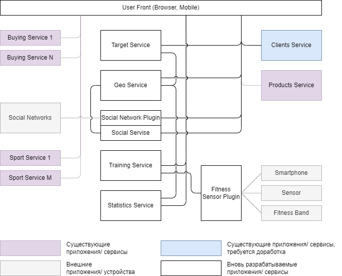

# Концептуальная архитектура #

## Сервисы и компоненты ##
1. <b>Buying Service (1-N)</b> - существующие сервисы/ приложения для покупок.
2. <b>Sport Service (1-M)</b> - существующие сервисы/ приложения для различных видов спорта.
3. <b>Clients Service</b> - сервис управления клиентскими данными (регистрация пользователя, авторизация, хранение данных о пользователях). Нуждается в доработке с целью добавления новых полей в БД клиентов, которые позволят идентифицировать виды спорта, снаряжение пользователя, его предпочтения и персональные настройки приватности.
4. <b>Products Service</b> - существующий сервис продуктов компании (допущение - такой сервис уже есть, и туда собираются данные обо всех продуктах).
5. <b>Social Networks</b> - внешние приложения соц. сетей, с которыми (возможно) потребуется интеграция.
6. <b>Fitness Sensor Plugin</b> - плагин/ сервис для интеграции с фитнес-функциями смартфона, датчиками пульса/ сердцебиения/ насыщения кислородом/ etc., фитнес-браслетом. Возможно, потребуются отдельные сервисы для каждого вида внешних датчиков/ приложений. 
7. <b>Smartphone</b> - фитнес-функции смартфона пользователя.
8. <b>Sensor</b> - датчики пульса/ сердцебиения/ насыщения кислородом/ etc.
9. <b>Fitness Band</b> - фитнес-браслеты пользователя. Возможно, потребуется разработка интегратора для основных производителей фитнес-браслетов.
10. <b>Statistics Service</b> - сервис для сбора и обработки статистики (тренировки, метрики пользователя, победы, награды, достижение тренировочных целей). 
11. <b>Training Service</b> - сервис для составления тренировок, выдачи рекомендаций по тренировкам, учёта пользовательского инвентаря.
12. <b>Social Service</b> - сервис для управления социальными группами (создание групп по интересам, поиск пользователей по схожим интересам, добавление друзей).
13. <b>Social Network Plugin</b> - плагины для подключения к соц. сетям (возможно, будут нужны, а возможно и нет).
14. <b>Geo Service</b> - сервис определения гео-локации, связь пользователей с гео-параметрами.
15. <b>Target Service</b> - сервис для таргетирования рекомендаций (новости, покупки) и промо-акций.
16. <b>User Front (Browser, Mobile)</b> - пользовательский фронт-сервис для выдачи контента, поставляемого другими сервисами. Возможно, нужна разработка web-версии и мобильной версии приложения.

## Интеграции ##
### Внешние интеграции (с существующими приложениями/ сервисами) ###
1. <b>Target Service - Buying Service (1-N)</b>: интеграция таргета с сервисами/ приложениями для покупок (получение промоакций, скидок).
2. <b>Social Network Plugin - Social Networks</b>: интеграция с соц. сетями для (возможного) использования их при формировании групп пользователей.
3. <b>Training Service - Sport Service (1-M)</b>: интеграция с сервисами/ приложениями для различных видов спорта (получение информации о составлении тренировок, особенностях разных видов спорта).
4. <b>Target Service - Products Service</b>: интеграция таргета с сервисом продуктов (получение информации о продуктах).
5. <b>Social Service - Clients Service</b>: интеграция с клиентским сервисом (получение информации о клиентах, передача информации о вхождении клиента в группы).
6. <b>Statistics Service - Clients Service</b>: интеграция с клиентским сервисом (получение информации о клиентах, передача информации о накопленных баллах и бонусах за тренировки и победу в соревнованиях).
7. <b>Fitness Sensor Plugin - Smartphone/ Sensor/ Fitness Band</b>: интеграция с фитнес-функциями смартфона, датчиков и фитнес-браслетов (получение информации о метриках пользователя и метриках тренировки).

### Интеграции на приложение фронта ###
1.

### Внутренние интеграции (между сервисами) ###
1.
